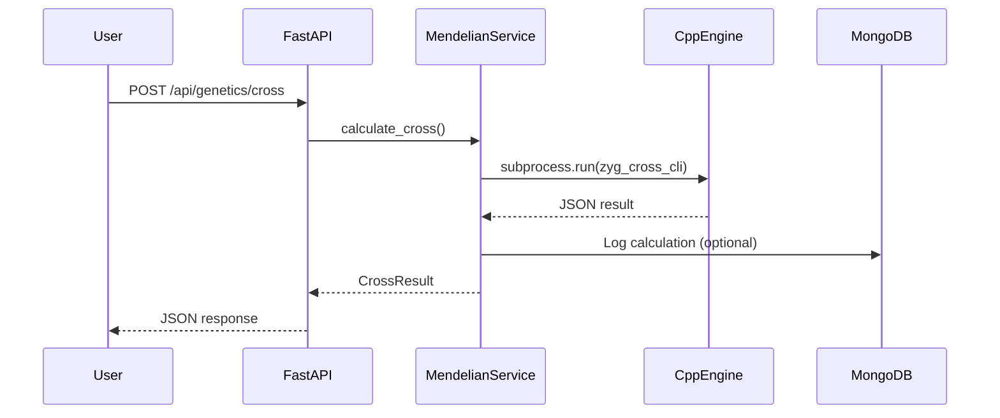
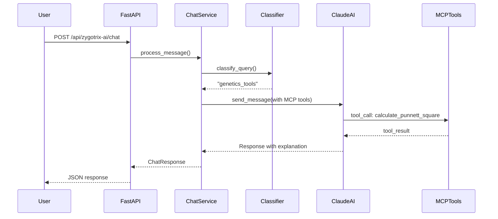

# Architecture Overview

Zygotrix is built on a modern, scalable architecture designed for high-performance genetics computations.

## High-Level Architecture

```
┌─────────────────────────────────────────────────────────────────────────┐
│                              CLIENTS                                     │
│  ┌──────────────┐  ┌──────────────┐  ┌──────────────┐                  │
│  │   Web App    │  │  Mobile App  │  │   API Users  │                  │
│  │  (React/TS)  │  │   (Future)   │  │  (curl/SDK)  │                  │
│  └──────┬───────┘  └──────┬───────┘  └──────┬───────┘                  │
└─────────┼─────────────────┼─────────────────┼───────────────────────────┘
          │                 │                 │
          └─────────────────┼─────────────────┘
                            │ HTTPS
                            ▼
┌─────────────────────────────────────────────────────────────────────────┐
│                         BACKEND (FastAPI)                                │
│  ┌──────────────────────────────────────────────────────────┐          │
│  │                    API Layer (Routes)                     │          │
│  │  /auth  /traits  /genetics  /gwas  /zygotrix-ai  /admin  │          │
│  └──────────────────────────┬───────────────────────────────┘          │
│                             │                                           │
│  ┌──────────────────────────┼───────────────────────────────┐          │
│  │                   Service Layer                           │          │
│  │  ┌─────────┐ ┌─────────┐ ┌─────────┐ ┌─────────────────┐ │          │
│  │  │  Auth   │ │ Traits  │ │  GWAS   │ │   Claude AI     │ │          │
│  │  │ Service │ │ Service │ │ Service │ │   (MCP Tools)   │ │          │
│  │  └─────────┘ └─────────┘ └────┬────┘ └─────────────────┘ │          │
│  └───────────────────────────────┼──────────────────────────┘          │
│                                  │                                      │
│  ┌───────────────────────────────┼──────────────────────────┐          │
│  │              C++ Engine Layer (subprocess)                │          │
│  │  ┌───────────┐  ┌───────────┐  ┌───────────┐             │          │
│  │  │zyg_cross  │  │zyg_gwas   │  │zyg_protein│             │          │
│  │  │   _cli    │  │   _cli    │  │   _cli    │             │          │
│  │  └───────────┘  └───────────┘  └───────────┘             │          │
│  └──────────────────────────────────────────────────────────┘          │
└─────────────────────────────────────────────────────────────────────────┘
          │                 │                 │
          ▼                 ▼                 ▼
┌──────────────┐   ┌──────────────┐   ┌──────────────┐
│   MongoDB    │   │    Redis     │   │ Cloud Storage│
│  (Primary)   │   │   (Cache)    │   │ (Files/GWAS) │
└──────────────┘   └──────────────┘   └──────────────┘
```

## Component Overview

### Frontend Layer

| Component | Technology | Purpose |
|-----------|-----------|---------|
| **zygotrix_ai** | React + TypeScript + Vite | AI chatbot interface |
| **zygotrix_university** | React + TypeScript | Educational courses |
| **web** | React + TypeScript | Main website |

### Backend Layer

| Component | Technology | Purpose |
|-----------|-----------|---------|
| **FastAPI** | Python 3.11+ | REST API framework |
| **Pydantic** | Python | Request/response validation |
| **Motor** | Python | Async MongoDB driver |
| **aioredis** | Python | Async Redis client |

### C++ Engine Layer

| Binary | Purpose | Performance |
|--------|---------|-------------|
| `zyg_cross_cli` | Mendelian genetics calculations | 10x faster than Python |
| `zyg_gwas_cli` | GWAS statistical analysis | 50x faster than Python |
| `zyg_protein_cli` | Protein translation | 5x faster than Python |
| `zyg_parallel_dna_cli` | Large DNA generation | Parallel processing |

### Data Layer

| Store | Purpose | Data Types |
|-------|---------|------------|
| **MongoDB** | Primary database | Users, traits, courses, conversations |
| **Redis** | Caching & sessions | Auth tokens, rate limits, query cache |
| **DigitalOcean Spaces** | File storage | GWAS datasets, VCF files |

## Request Flow

### Example: Punnett Square Calculation



### Example: AI Chatbot Query



## Key Design Decisions

### Why C++ Engine?

GWAS analysis involves matrix operations on potentially millions of SNPs. Python with NumPy would be too slow:

| Operation | Python | C++ (Eigen) | Speedup |
|-----------|--------|-------------|---------|
| 10K SNPs linear regression | 60s | 3s | **20x** |
| 100K SNPs chi-square | 5min | 15s | **20x** |
| 1M SNPs parallel | N/A | 5min | ∞ |

### Why Subprocess (not Python bindings)?

1. **Isolation** - C++ crash doesn't affect Python process
2. **Debugging** - Can run CLI directly for testing
3. **Simplicity** - JSON in/out, no complex bindings
4. **Deployment** - Just copy binary, no compilation on server

### Why Claude AI with MCP?

1. **Tool Use** - Claude natively calls Zygotrix tools
2. **Context** - Maintains conversation history
3. **Accuracy** - Better genetics knowledge than base models
4. **Streaming** - Real-time response generation

## Directory Structure

```
Zygotrix/
├── backend/                  # Python FastAPI backend
│   ├── app/
│   │   ├── routes/          # API endpoints
│   │   ├── services/        # Business logic
│   │   ├── repositories/    # Data access
│   │   ├── schema/          # Pydantic models
│   │   ├── mcp/             # MCP tool integration
│   │   └── chatbot_tools/   # AI chatbot tools
│   └── .env.example
├── zygotrix_ai/             # React AI chatbot frontend
├── zygotrix_engine_cpp/     # C++ high-performance engine
│   ├── src/                 # C++ source files
│   ├── include/             # Header files
│   ├── build/               # Compiled binaries
│   └── third_party/         # Eigen, json11
├── zygotrix_university/     # Educational platform
└── zygotrix_docs/           # This documentation
```

## Next Steps

- [Backend Architecture](./backend) - Deep dive into FastAPI structure
- [C++ Engine](./cpp-engine) - Understanding the performance layer
- [AI Chatbot Architecture](./ai-chatbot) - How Zigi works
